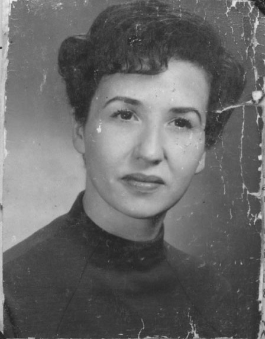
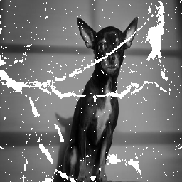
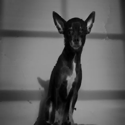

# Restauration d’images bruitées par CNN
## Auteurs
* M.Awwad
* A.Stefanova  


# Résultats


  




## Interface
Lancez le fichier ```Jupyter/UI.ipynb```


  
  
  
## Code hébergé sur Google Colab 
[Lien Google Colab](https://colab.research.google.com/drive/1XOI2CuFGAuuVb5-rNc32Bgl172mWJmcB?usp=sharing)

## Ressources
[Article Old Photo Restoration via Deep Latent Space Translation](https://arxiv.org/pdf/2009.07047.pdf)
<!-- ## Description -->
